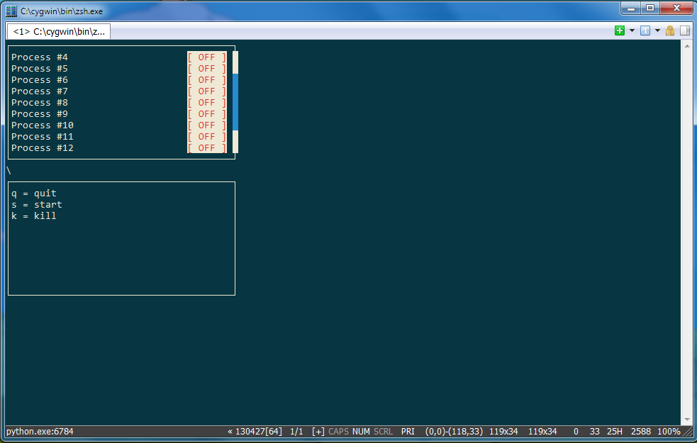

# Application Monitor

Provides the ability to start/stop all the programs needed in a system.

## Screenshots

## Coding style

[Google Python Style Guide][style-guide]

[style-guide]: http://google-styleguide.googlecode.com/svn/trunk/pyguide.html
